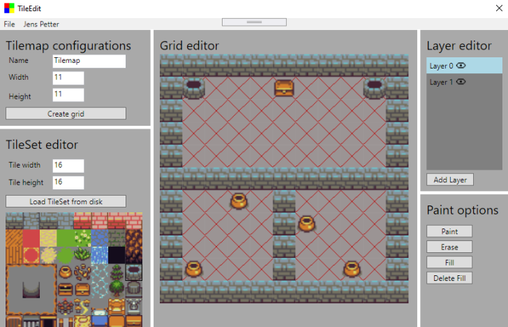

# TileEdit
 A Tilemap editor made in WPF. Integrated are a grid editor, layer options, tileset eidtor and paint options. Data is exported as JSON. Loading using a JSON formatted file is also supported.
 
# The editor
Like said earlier, the editor of TileEdit has a lot of options. One can of course load tilesets to create tilemaps with. A layer system is integrated in TileEdit where one can disable and enable these layers. TileEdit also has different paint options. TileEdit supports "paint", "erase", "fill" and "delete fill" paint options.



**Notes that usage of multiple tilesets is not supported by TileEdit.**

# Export structure
Exports using TileEdit are JSON files. Below is shown an example of a TileEdit JSON file.
```json
{
  "Name": "ExampleName",
  "TilemapWidth": 11,
  "TilemapHeigh": 11,
  "GridLayers": [
    [ 0, 0, 0, 0, 0, 0, 0, 0, 0, 0, 0, 0, -1, -1, -1, -1, -1, -1, -1, -1, -1, 0, 0, -1, -1, -1, -1, -1, -1, -1, -1, -1, 0, 0, -1, -1, -1, -1, -1, -1, -1, -1, -1, 0, 0, -1, -1, -1, -1, -1, -1, -1, -1, -1, 0, 0, 0, 0, 0, 0, 0, 0, 0, 0, 0, 0, 0, -1, -1, -1, -1, 0, -1, -1, -1, -1, 0, 0, -1, -1, -1, -1, 0, -1, -1, -1, -1, 0, 0, -1, -1, -1, -1, 0, -1, -1, -1, -1, 0, 0, -1, -1, -1, -1, 0, -1, -1, -1, -1, 0, 0, 0, 0, 0, 0, 0, 0, 0, 0, 0, 0 ],
    [ -1, -1, -1, -1, -1, -1, -1, -1, -1, -1, -1, -1, 31, -1, -1, -1, 36, -1, -1, -1, 31, -1, -1, -1, -1, -1, -1, -1, -1, -1, -1, -1, -1, -1, -1, -1, -1, -1, -1, -1, -1, -1, -1, -1, -1, -1, -1, -1, -1, -1, -1, -1, -1, -1, -1, -1, -1, -1, -1, -1, -1, -1, -1, -1, -1, -1, -1, -1, -1, -1, 27, -1, -1, -1, -1, -1, -1, -1, -1, -1, -1, -1, -1, 27, -1, -1, -1, -1, -1, -1, -1, -1, -1, -1, -1, -1, -1, -1, -1, -1, 27, -1, -1, -1, -1, -1, -1, 27, -1, -1, -1, -1, -1, -1, -1, -1, -1, -1, -1, -1, -1 ]
  ],
  "TileWidth": 16,
  "TileHeight": 16,
  "LoadedTilesetPath":"PathToTileset\ExampleName.png"
}
```

GridLayers storese every tile ID for every layer. A layer is simply an element in GridLayers. -1 indicates that this tile is not painted, All other numbers indicate the ID of the tile corresponding the tile location in the tileset that has been used for the creation of this tile.

**Notes that usage of multiple tilesets is not supported by TileEdit.**
